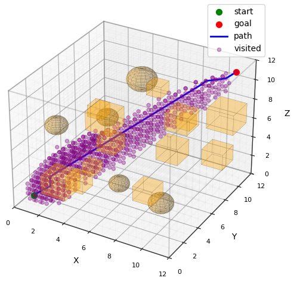

# motion-planning goal

Minimal 3D motion-planning playground in Python. The goal is a clean, reusable
base for experimenting with algorithms (A*, RRT, RRG, MPC, etc.), collision
checking, and visualization.

And also, learning about motion-planning, specially optimization-based algorithms 및 learning-based motion planning algorithms.

## A*
A* is one of the most widely used path-planning algorithms. It uses a heuristic-based cost function to guide the search toward a shortest path.
The result image is shown below.
<p align="center">
  
</p>

## Quick start
Run the world demo (A* path + visited nodes):
```bash
python examples/world_demo.py
```

## Project layout
- `motion_planning/` core library (world, collision, planners, visualization)
- `examples/` runnable demos
- `tests/` pytest-based tests
- `docs/` images and notes

## Notes
- Visualization requires `matplotlib` (and `numpy` for sphere rendering).
- The world is intentionally minimal; extend as needed.
