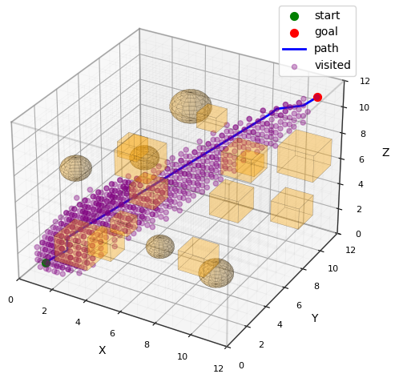
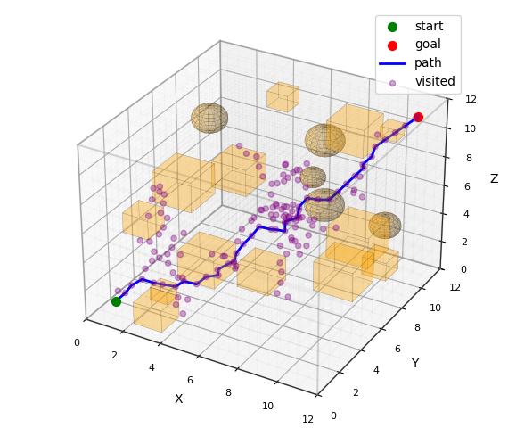
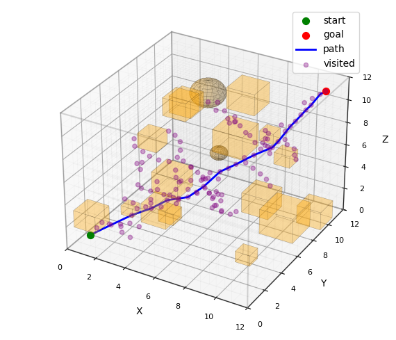

# motion-planning goal

## Table of Contents
- [A*](#a)
- [RRT](#rrt)
- [RRT*](#rrt-1)

Minimal 3D motion-planning playground in Python. The goal is a clean, reusable
base for experimenting with algorithms (A*, RRT, RRG, MPC, etc.), collision
checking, and visualization.

And also, learning about motion-planning, specially optimization-based algorithms 및 learning-based motion planning algorithms.

## A*
A* is one of the most widely used path-planning algorithms. It uses a heuristic-based cost function to guide the search toward a shortest path.
The result image is shown below.
<p align="center">
  
</p>

## RRT
RRT (Rapidly-exploring Random Tree) grows a tree by random sampling, quickly
exploring large spaces and connecting to the goal when it gets close. It is
fast to find feasible paths but does not guarantee an optimal path.
The result image is shown below.
<p align="center">
  
</p>

## RRT*
RRT* extends RRT by rewiring nearby nodes to reduce path cost. It typically
finds better paths than RRT given more iterations, at the cost of extra
computation.
The result image is shown below.
<p align="center">
  
</p>

## Demo results
The following results are from the demo runs with the same world settings.
Random sampling can change the numbers across runs.

| Planner | Start | Goal | Obstacles | Success | Iters | Path length |
| --- | --- | --- | --- | --- | --- | --- |
| A* | (1.0, 1.0, 1.0) | (11.0, 11.0, 11.0) | 18 | True | 665 | 23 |
| RRT | (1.0, 1.0, 1.0) | (11.0, 11.0, 11.0) | 18 | True | 160 | 39 |
| RRT* | (1.0, 1.0, 1.0) | (11.0, 11.0, 11.0) | 18 | True | 140 | 18 |

## Quick start
Run the demos:
```bash
python examples/astar_demo.py
python examples/rrt_demo.py
python examples/rrt_star_demo.py
```

## Project layout
- `motion_planning/` core library (world, collision, planners, visualization)
- `examples/` runnable demos
- `tests/` pytest-based tests
- `docs/` images and notes

## Notes
- Visualization requires `matplotlib` (and `numpy` for sphere rendering).
- The world is intentionally minimal; extend as needed.

## Author
- Hyoungho Park
